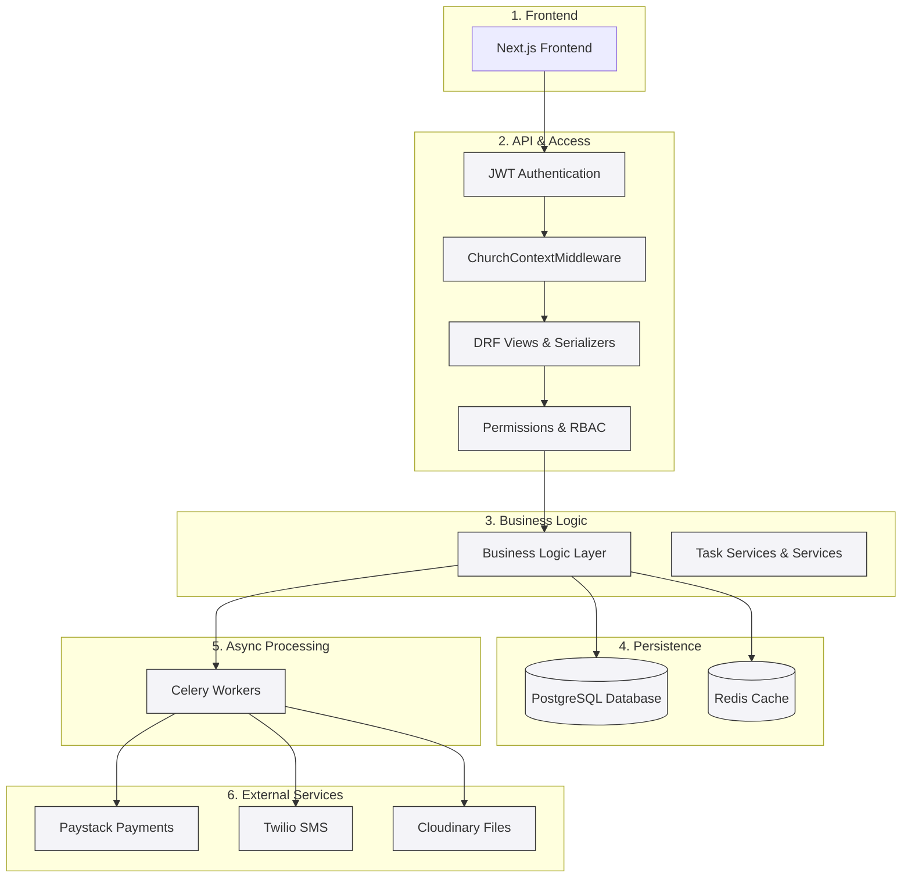
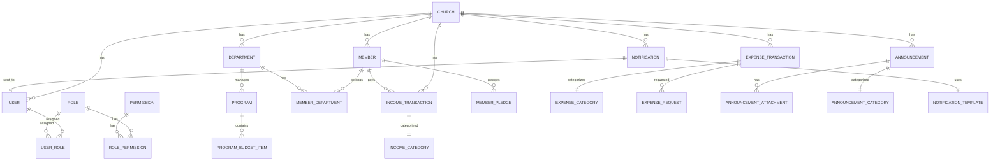

# Church Management SaaS - Backend Architecture

## Overview

This document provides a comprehensive overview of the backend architecture for the Church Management SaaS platform. The system is built using Django 5.2 with Django REST Framework, implementing a multi-tenant SaaS model for church management.

### Tech Stack
- **Framework:** Django 5.2 + Django REST Framework (DRF)
- **Database:** PostgreSQL
- **Authentication:** JWT (djangorestframework_simplejwt)
- **Task Queue:** Celery + Redis
- **File Storage:** Cloudinary
- **Payments:** Paystack API
- **SMS/Notifications:** Twilio
- **Permissions:** django-guardian + custom RBAC

### Key Features
- Multi-tenant architecture with church-level data isolation
- Role-based access control (RBAC) with fine-grained permissions
- Payment processing and subscription management
- Member management with visitor-to-member conversion
- Department and program budget management (5-step approval flow)
- Treasury management (income, expenses, pledges, assets)
- Announcements and notifications system
- Reports and analytics dashboard
- File upload and management

## Main Components

### Django Apps
1. **accounts** - Authentication, user management, roles/permissions, payments
2. **members** - Member profiles, registration, visitors
3. **departments** - Department management, program budgets
4. **treasury** - Financial tracking and management
5. **announcements** - Church communications
6. **notifications** - In-app, email, and SMS notifications
7. **secretariat** - Church records
8. **reports** - Report generation and caching
9. **analytics** - Dashboard metrics
10. **files** - File upload/management
11. **agents** - AI/bot activity logging
12. **backup** - Backup operations
13. **core** - System utilities and audit logs

### Key Models
- **Church** - Tenant entity with subscription details
- **User** - System users with roles
- **Member** - Church members/visitors
- **Role/Permission** - RBAC system
- **Department/Program** - Ministry teams and budgets
- **Income/Expense** - Financial transactions
- **Announcement/Notification** - Communication systems

## Deployed Architecture Diagram



## Data Model / ER Diagram



## Authentication & Authorization

### Authentication Flow
1. User login with email/password/church_id
2. JWT tokens issued (access + refresh)
3. Tokens include user_id, church_id, platform_admin status

### Multi-tenancy
- ChurchContextMiddleware resolves current church from JWT
- Platform admins can access multiple churches
- Regular users scoped to their church

### RBAC System
- Users assigned to Roles
- Roles have Permissions (MODULE.ACTION format)
- Permission checks: has_permission(user, "TREASURY.VIEW", church)

## Key Workflows

### Registration Flow
1. Church info submission
2. Admin user creation
3. Plan selection and payment
4. Subscription activation via Paystack

### 5-Step Budget Submission
1. Basic program info
2. Budget items entry
3. Department elder review
4. Secretariat review
5. Treasury final approval

### Payment Integration
- Paystack for subscription billing
- Webhook handling for payment confirmations
- Recurring subscription management

## Deployment Architecture

```
┌─────────────────┐    ┌─────────────────┐
│   Load Balancer │    │   Web Server    │
│    (Nginx)      │────│   (Gunicorn)    │
└─────────────────┘    └─────────────────┘
                              │
                    ┌─────────┼─────────┐
                    │         │         │
            ┌───────▼───┐ ┌───▼───┐ ┌───▼───┐
            │ PostgreSQL │ │ Redis │ │ Celery│
            │  Database  │ │ Cache │ │Workers│
            └────────────┘ └───────┘ └───────┘
                    │         │         │
            ┌───────▼───┐ ┌───▼───┐ ┌───▼───┐
            │  Paystack  │ │Twilio │ │Cloudinary│
            │  Payments  │ │  SMS  │ │  Files   │
            └────────────┘ └───────┘ └─────────┘
```

## Security Measures
- JWT token authentication with refresh rotation
- Multi-tenant data isolation
- Role-based permissions
- Account lockout after failed attempts
- Email verification and MFA support
- Soft deletes for data preservation

## Background Tasks
- Email/SMS notification delivery
- Payment webhook processing
- Report generation and caching
- Password reset emails
- Subscription renewal handling

This architecture supports scalable, secure, multi-tenant church management with comprehensive financial tracking, communication tools, and administrative controls.</content>
<parameter name="filePath">/home/professor/Desktop/church-management-saas-backend/backend_architecture.md
